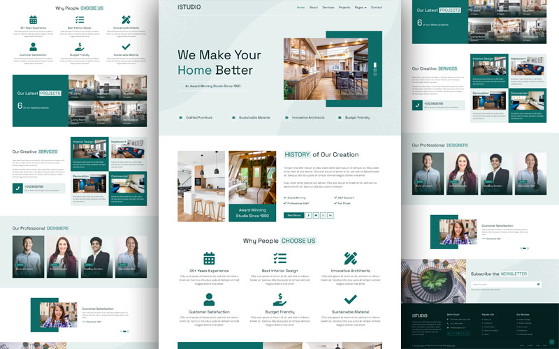
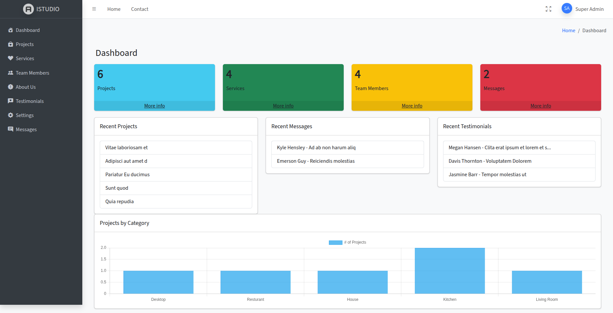
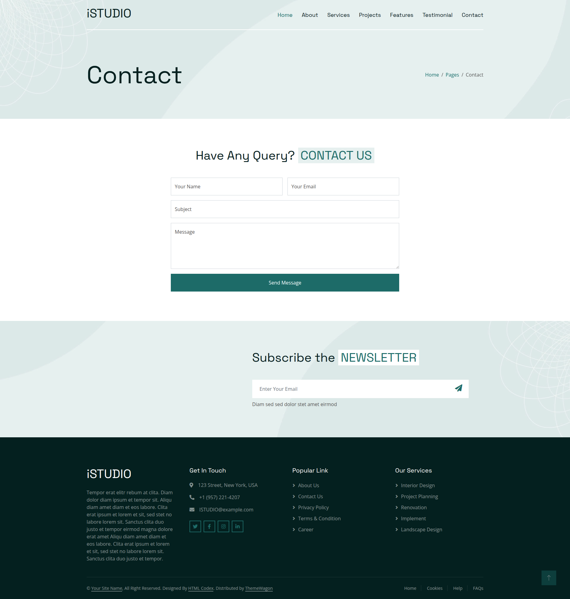

# ISTUDIO – Creative Interior Design Agency



**ISTUDIO** is a modern, responsive, and professional interior design website built with **Laravel 12** and **AdminLTE**. This project showcases services, portfolio projects, team members, testimonials, and a fully functional contact form.

---

## 🚀 Features

- **Homepage:** Dynamic sections for services, projects, testimonials, and team members.
- **About Page:** Agency information and philosophy.
- **Services & Projects Pages:** Detailed list of services and portfolio projects.
- **Team Members:** Show all team members dynamically from the database.
- **Testimonials:** Display client reviews dynamically.
- **Contact Form:** Fully functional contact form storing submissions in the database.
- **Admin Dashboard:** Powered by AdminLTE with:
  - Project, Service, Team, Messages, Testimonials statistics.
  - Quick Actions / Shortcuts (Add Project, Add Service, Respond to Messages, Add Team Member).
- **Responsive Design:** Works on desktop, tablet, and mobile devices.
- **Authentication:** Admin login to manage content securely.

---

## 🖼 Screenshots

**Homepage**


**Dashboard**


**Contact Form**


---

## 🛠 Technologies Used

- **Backend:** Laravel 12, PHP 8.3
- **Frontend:** HTML, CSS, JavaScript, AdminLTE, Bootstrap
- **Database:** MySQL
- **Other Tools:** Composer, NPM, Vite

---

## 💾 Installation

1. Clone the repository:
```bash
git clone https://github.com/abdallah-hasan23/ISTUDIO.git


Navigate to the project folder:


cd istudio


Install PHP dependencies:


composer install


Install frontend dependencies:


npm install
npm run dev


Copy .env.example to .env and set your database and other configurations:


cp .env.example .env


Generate application key:


php artisan key:generate


Run migrations:


php artisan migrate


Seed the database with sample data (optional):


php artisan db:seed


Start the development server:


php artisan serve


👤 Admin Access


Default user for testing:


Email: admin@admin.ps


Password: admin


Make sure to change credentials in production.


📦 Project Structure
├── app/
│   ├── Http/Controllers/
│   ├── Models/
├── database/
│   ├── migrations/
│   └── seeders/
├── public/
│   └── images/screenshots/  # Store screenshots here
├── resources/views/  # Blade templates
├── routes/web.php
└── README.md


🔗 Useful Links


GitHub: https://github.com/abdallah-hasan23/ISTUDIO.git


Email: abdallahshantti@gmail.com


📄 License
This project is open-source and available under the MIT License.

